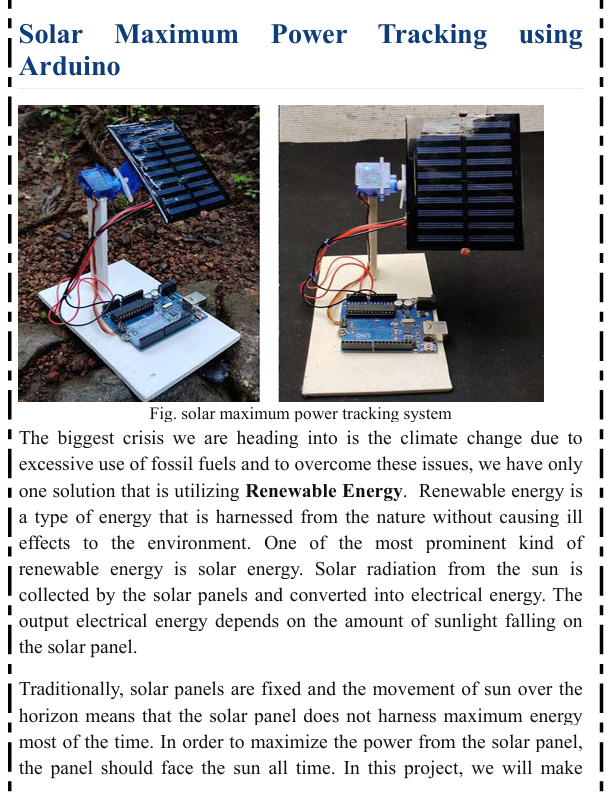
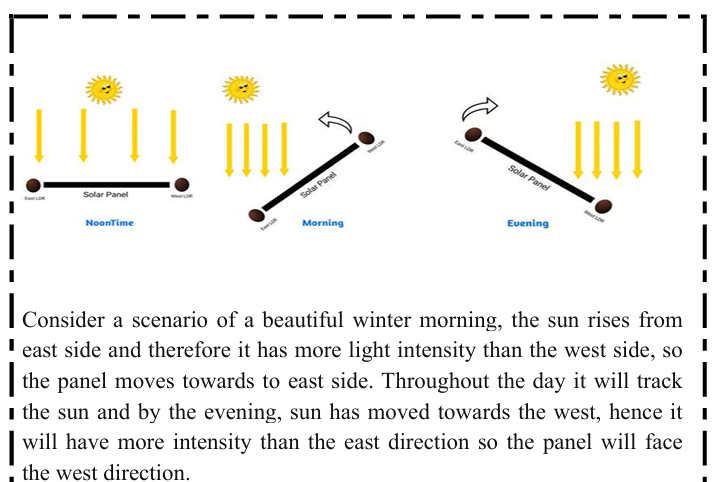
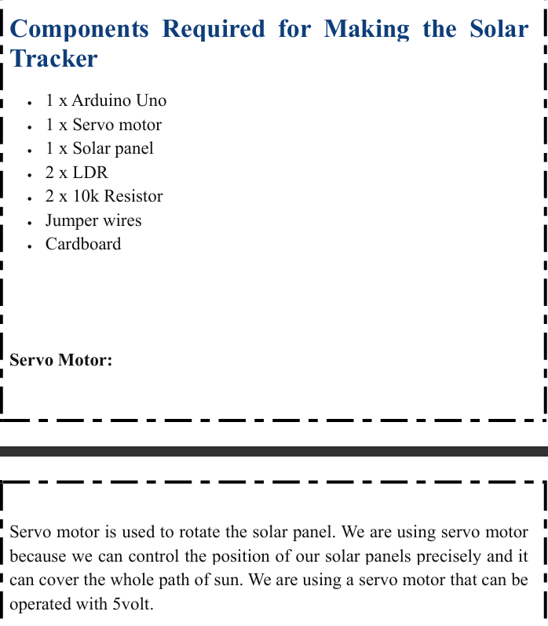
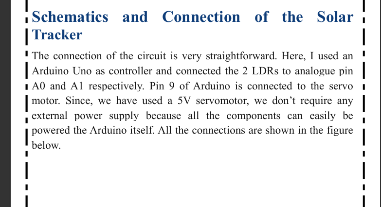
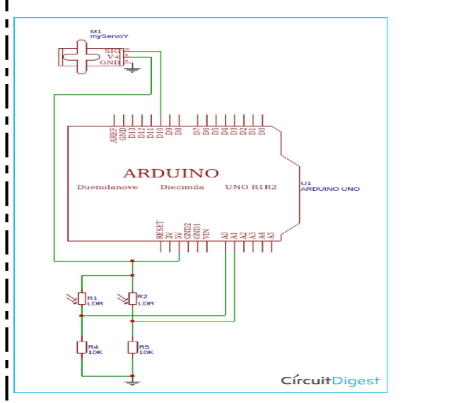
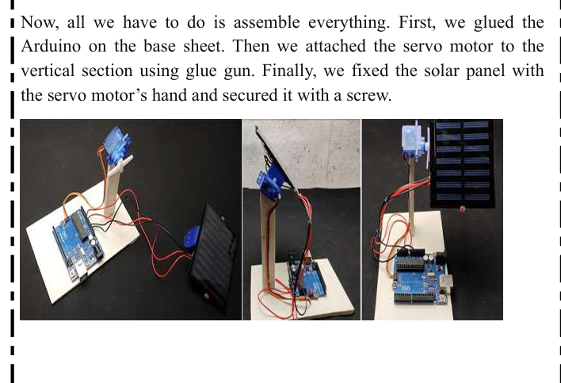
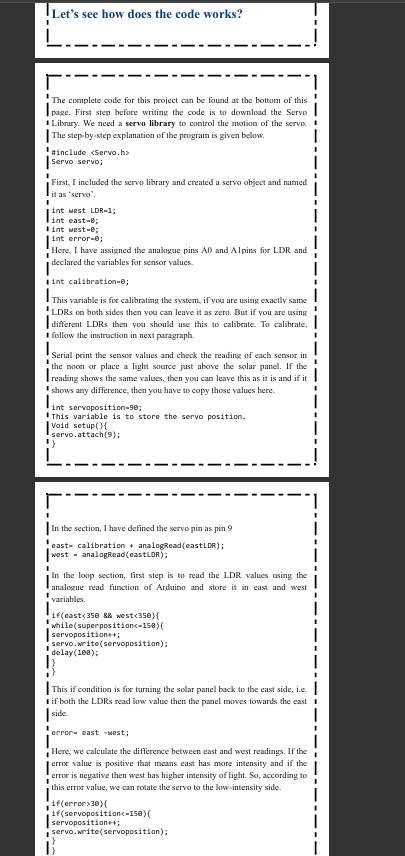
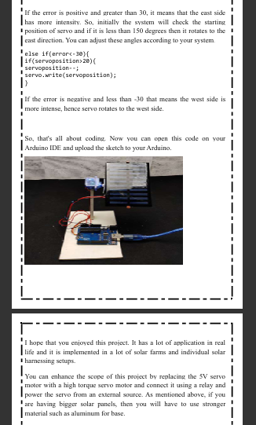

# Servo Motor Control Using LDRs

This project controls the position of a servo motor based on the light intensity detected by two LDR (Light Dependent Resistor) sensors. It automatically adjusts the servo to track the brighter light source.

---

##  Theory

The project is based on the principle of a light-following mechanism:
- Two LDRs are placed such that they sense light from different directions.
- The difference in light intensity from the two LDRs is measured.
- Depending on which side is brighter, the servo motor rotates to align with the light.

### Theory in Images:

*Light sensing using LDRs.*

*Error calculation based on the difference in LDR readings.*

*Servo adjusts its position according to the light direction.*

---

##  Components Used

- 1 × Arduino board
- 1 × Servo motor
- 2 × LDR sensors
- 2 × Resistors (10kΩ, for voltage divider)
- Breadboard and jumper wires
- Power supply

### Components in Images:

*All electronic components.*

*Close-up of the servo and LDRs.*

---

## 🔗 Connections & Circuit

The two LDRs are connected to the analog pins of the Arduino. A voltage divider is used with each LDR to provide a measurable voltage. The servo motor signal wire is connected to a PWM-capable digital pin.

### Circuit in Images:

*Wiring diagram of the setup.*

*Breadboard connection of the circuit.*

---

##  How the Code Works

- The Arduino continuously reads analog values from the east and west LDRs.
- If the difference between them exceeds a threshold, the servo motor rotates towards the brighter side.
- The servo stops when the difference falls below the threshold.

### Code in Images:

*Reading LDR values and calculating error.*

*Controlling servo position based on error.*

---

## Conclusion

This project demonstrates how to build a simple light-tracking system using a servo motor and two LDRs. It is a good example of a closed-loop feedback control system.

---

